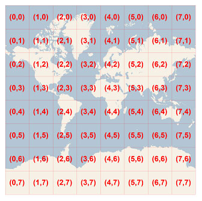
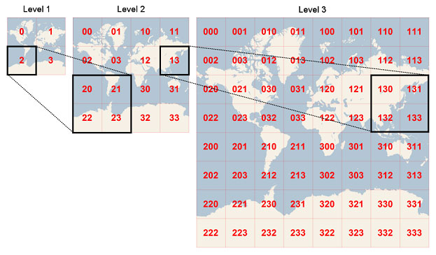

skilz
======

Programming puzzles to exercise your coding-fu.

The Rules
---------

On Monday (ish) of every week, someone will toss out a programming
puzzle. On Friday (ish), we will have a little "brown bag" lunch thing
to show off our individual solutions to the puzzle. This will not be
"graded", reflect on anyone's performance review, or have any impact
on your professional status.

In more detail, here are the rules (or as many as we have thought up thus far):

* Working code is cool, but algorithms are fine too.
* Don't put in more effort than an hour or so and don't let this
  exercise ever interfere with actual work.
* Any language is fair game.
* This is not a competition, but strong Kung Fu will be respected.
* Magic tricks, doubly so.
* During show-and-tell, only positive comments are allowed. Friendly
  trash talk will only be allowed between those that have successfully
  solved the puzzle.
* This isn't about coding standards. Anyone who brings up coding
  standard violations will be banished from show-and-tell and their
  brown bag lunch confiscated.
* Brown bag lunch will probably involve ordering in pizza or other
  yummies because none of us will remember to pack a lunch.
* Admission to show-and-tell is not restricted to entrants only. In
  other words, you can still come and watch without being compelled to
  show your own.
* It is totally not acceptable to pull answers off the internet or use
  books for more than API or language references. Also, no fair
  calling up buddies at Intel/Microsoft/NASA/Google/...

2010-11-29
----------

Write a program in any language that takes a integer parameter n and
outputs each number from 0 to n in random order where each number
appears only once.

2010-12-06
----------

Find all the two-word compound words in a dictionary. A two-word
compound word is a word in the dictionary that is the concatenation of
exactly two other words in the dictionary. Assume input will be a
number of lowercase words, one per line, in alphabetical order,
numbering around, say, 100K. Generate output consisting of all the
compound words, one per line, in alphabetical order.

2010-12-13
----------

Given any integer 0 <= n <= 10000 not divisible by 2 or 5, find the
number of digits in the smallest multiple of n that is a number which
in decimal notation is a sequence of 1's.

2010-12-20
----------

Write a simple mail merge program that accepts a document and a data
file. The document will contain variable text identified as $n where n
is the zero-based data field number in the data file. The data file
will be a tab delimited file containing no header line. Merge and
write the merged document(s) to the screen.

2011-01-14
----------

Given an integer number (say, a 32 bit integer number), write code to
count the number of bits set (1s) that comprise the number.  For
instance: 87338 (decimal) = 10101010100101010 (binary) in which there
are 8 bits set.  No twists this time and as before, there is no
language restriction.

2011-01-24
----------

You are one of two players in a game. Presented to both of you is a
row of little buckets with a number of gold coins in each. The number
of the coins in each bucket is known to both of you. Alternating
turns, you get to choose a bucket from either end of the row and
pocket the gold. However, you only can choose buckets at the ends and
you always go first.

Write a program that will maximize your take. Accept as input a file representing the bucket amounts in the form::

    # # #

As output, display the amount you were able to pocket.

2011-02-07
----------

This is a two part puzzle but don't worry if you don't solve both parts.

Part 1
~~~~~~

A magic square is a an n x n array of numbers consist of the integers
1, 2, ..., n^2 arranged so that the sum of the numbers in every row,
column and main diagonals is the same. For example, in a 4 x 4 square
the numbers are 1, 2, ..., 16 and could be arranged thusly to create
the sum 34::

    +----+----+----+----+
    | 16 |  3 |  2 | 13 |
    +----+----+----+----+
    |  5 | 10 | 11 |  8 |
    +----+----+----+----+
    |  9 |  6 |  7 | 12 |
    +----+----+----+----+
    |  4 | 15 | 14 |  1 |
    +----+----+----+----+

For the first part, write a program that can produce magic squares
with values of n from 4 to, say, 28 (inclusively).

Part 2
~~~~~~

Magic squares "retain water" when an individual cell is surrounded
(edge to edge; not corner to corner) by cells of higher or equal
value. The amount of water retained by a cell is the difference
between the cell and it shortest neighbor. Also, multiple adjacent
cells surrounded by taller cells can increased individually to the
level of the shortest border cell. Obviously, outer edge cells cannot
retain water.

For instance::

    +----+----+----+----+
    |  7 | 12 |  1 | 14 |
    +----+----+----+----+
    |  2 | 13 |  8 | 11 |
    +----+----+----+----+
    | 16 |  3 | 10 |  5 |
    +----+----+----+----+
    |  9 |  6 | 15 |  4 |
    +----+----+----+----+

Retains 3 because the cell containing 3 could retain an additional 3
before overflowing the border cell with 6::

    +----+----+----+----+
    |  7 | 12 |  1 | 14 |
    +----+----+----+----+
    |  2 | 13 |  8 | 11 |
    +----+----+----+----+
    | 16 |  6 | 10 |  5 |
    +----+----+----+----+
    |  9 |  6 | 15 |  4 |
    +----+----+----+----+

Or, for example::

    +----+----+----+----+
    | 16 |  3 |  2 | 13 |
    +----+----+----+----+
    |  5 | 10 | 11 |  8 |
    +----+----+----+----+
    |  9 |  6 |  7 | 12 |
    +----+----+----+----+
    |  4 | 15 | 14 |  1 |
    +----+----+----+----+

Could retain 5 by increasing 6 and 7 thusly::

    +----+----+----+----+
    | 16 |  3 |  2 | 13 |
    +----+----+----+----+
    |  5 | 10 | 11 |  8 |
    +----+----+----+----+
    |  9 |  9 |  9 | 12 |
    +----+----+----+----+
    |  4 | 15 | 14 |  1 |
    +----+----+----+----+

So, part 2 of this is to determine which of the possible magic squares
for n retains the most water.  Please accept a value of n as input and
output the highest water retaining magic square as output.

2011-03-09
----------

The premise is that in the brave new world, a phone will be developed
where the letters that appear on the keys are, well, just different::

    e | j n q | r w x | d s y | f t | a m | c i v | b k u | l o p | g h z
    0 |   1   |   2   |   3   |  4  |  5  |   6   |   7   |   8   |   9

Additionally, the phone numbers can be all different lengths.

Given a phone number and a dictionary, write a program to find all
words in the dictionary that could be an encoding of the phone
number. For a chance to gain even more prestige, find encodings of the
number that encompass more than a single word (two smaller words).

2011-03-21
----------

This is based on a Car Talk Puzzler:

An isogram (also known as a "nonpattern word") is a logological term
for a word or phrase without a repeating letter. It is also used by
some to mean a word or phrase in which each letter appears the same
number of times, not necessarily just
once. (http://en.wikipedia.org/wiki/Isogram)

Examples:

* 'Wyoming' is an isogram, while 'Alabama' is not.
* 'Many' and 'few' are isograms, 'none' is not.
* 'Toto' is an isogram by the second definition, but not the first.

Requirement: Given a word or phrase, report whether or not it's an
isogram by the first definition above. Bonus: test for the second
definition.

2011-04-30
----------

Say you have a grid where each square is denoted by a row and column
(aka a 'Google tile'), like this:

Now another way to denote each square in the grid is to use a quadkey
(a la Microsoft Bing), which looks like this:

Write code that translates from the row, column to the quadkey and
from a quadkey to row, column at all resolution levels from 1 to 23
(best available from Microsoft tile servers).  Assume that the size of
the tiles is the same at each resolution level.  In other words, if
you had a Bing quadkey at level 3, this would correspond to the tile
map at the top of this email which is 8x8.

Hint: there are a number of solutions.

2011-05-24
----------

Given an array of numbers, print them on a grid in a spiral. For
instance, if the array of numbers is 1 through 16, then the resulting
grid would appear as::

    +----+----+----+----+
    |  1 |  2 |  3 |  4 |
    +----+----+----+----+
    | 12 | 13 | 14 |  5 |
    +----+----+----+----+
    | 11 | 16 | 15 |  6 |
    +----+----+----+----+
    | 10 |  9 |  8 |  7 |
    +----+----+----+----+

Start always at the top left, go right, down, left, up, repeat to the
center.  Assume that the array when formatted thusly will always fit
perfectly in the grid.  Let's keep it "simple" and assume that the
grid is always square. Input parameter to the sample program will be
the grid side size.

2014-04-14
----------

Assume an input stream consisting of "base number\\n", write a program
to which takes a base argument and converts the input stream number
from input stream base to the parameter base.

Example given an argument of 10:

+--------+--------+
| Input  | Output |
+--------+--------+
| 16 4f  | 79     |
+--------+--------+
| 8 6251 | 3241   |
+--------+--------+

Bases greater than 1 and less than 36 are valid. Assume the extended
hex base 35 alphabet and a maximum of base 36:

+-------+--------+-+-------+--------+-+-------+--------+-+-------+--------+
| Value | Symbol | | Value | Symbol | | Value | Symbol | | Value | Symbol |
+=======+========+=+=======+========+=+=======+========+=+=======+========+
|     0 |      0 | |     9 |      9 | |    18 |      I | |    27 |      R |
+-------+--------+-+-------+--------+-+-------+--------+-+-------+--------+
|     1 |      1 | |    10 |      A | |    19 |      J | |    28 |      S |
+-------+--------+-+-------+--------+-+-------+--------+-+-------+--------+
|     2 |      2 | |    11 |      B | |    20 |      K | |    29 |      T |
+-------+--------+-+-------+--------+-+-------+--------+-+-------+--------+
|     3 |      3 | |    12 |      C | |    21 |      L | |    30 |      U |
+-------+--------+-+-------+--------+-+-------+--------+-+-------+--------+
|     4 |      4 | |    13 |      D | |    22 |      M | |    31 |      V |
+-------+--------+-+-------+--------+-+-------+--------+-+-------+--------+
|     5 |      5 | |    14 |      E | |    23 |      N | |    32 |      W |
+-------+--------+-+-------+--------+-+-------+--------+-+-------+--------+
|     6 |      6 | |    15 |      F | |    24 |      O | |    33 |      X |
+-------+--------+-+-------+--------+-+-------+--------+-+-------+--------+
|     7 |      7 | |    16 |      G | |    25 |      P | |    34 |      Y |
+-------+--------+-+-------+--------+-+-------+--------+-+-------+--------+
|     8 |      8 | |    17 |      H | |    26 |      Q | |    35 |      Z |
+-------+--------+-+-------+--------+-+-------+--------+-+-------+--------+
